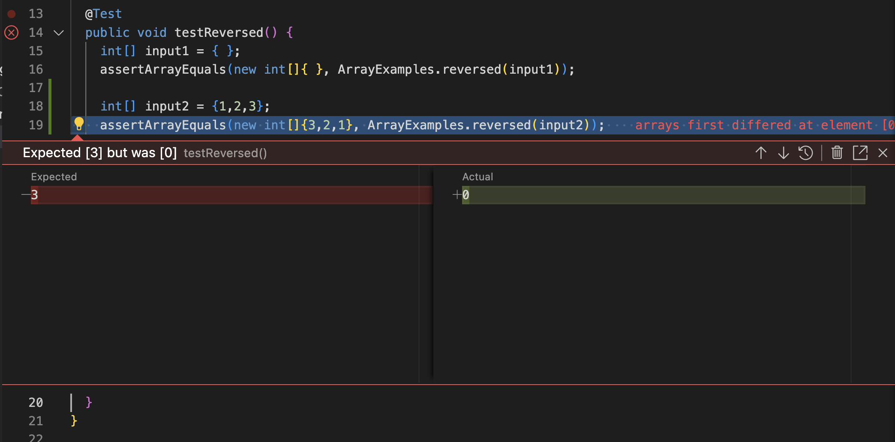

## Part 2
For this part, I chose the reversed method as the method that contains a bug in the code. 

A failure-inducing input for the buggy program as a JUnit test:

```
public void testReversed() {
    int[] input2 = {1,2,3};
    assertArrayEquals(new int[]{3,2,1}, ArrayExamples.reversed(input2));
  } 
```

An input that doesn’t induce a failure as a JUnit test:

```
public void testReversed() {
    int[] input1 = { };
    assertArrayEquals(new int[]{ }, ArrayExamples.reversed(input1));
  }
```

The Symptom:



Code before it is fixed (buggy code):

```
static int[] reversed(int[] arr) {
    int[] newArray = new int[arr.length];
    for(int i = 0; i < arr.length; i += 1) {
      arr[i] = newArray[arr.length - i - 1];
    }
    return arr;
  }
```
Changed code to fix: 

```
static int[] reversed(int[] arr) {
    int[] newArray = new int[arr.length];
    for(int i = 0; i < arr.length; i++) {
      newArray[arr.length - 1 - i] = arr[i];
    }
    return newArray;
  }
```


