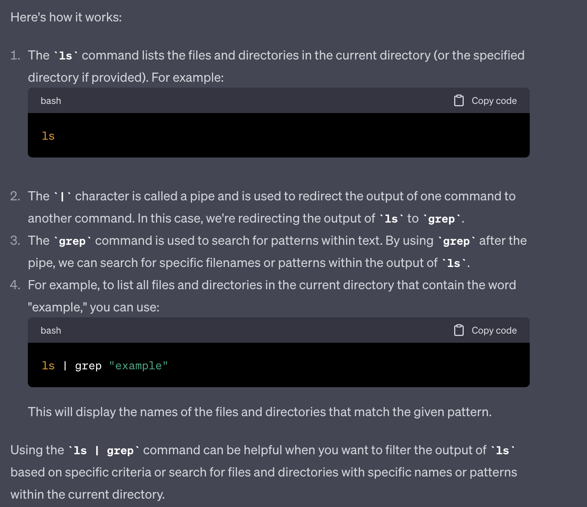
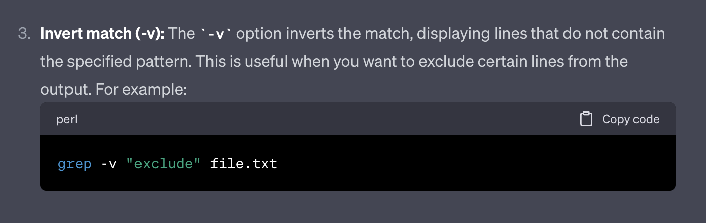

# Lab Report 3 - Researching Commands 

# 4 interesting command-line options or alternate ways to use the `grep` command:

## 1) `grep -i` command:

**Ex.1)**

**Command:** 
```
grep -i "peoPLE" technical/911report/chapter-1.txt
```

**Output:** 
```
Tuesday, September 11, 2001, dawned temperate and nearly cloudless in the eastern United States. Millions of men and women readied themselves for work. Some made their way to the Twin Towers, the signature structures of the World Trade Center complex in New York City. Others went to Arlington, Virginia, to the Pentagon. Across the Potomac River, the United States Congress was back in session. At the other end of Pennsylvania Avenue, people began to line up for a White House tour. In Sarasota, Florida, President George W. Bush went for an early morning run.
    Sweeney calmly reported on her line that the plane had been hijacked; a man in first class had his throat slashed; two flight attendants had been stabbed-one was seriously hurt and was on oxygen while the other's wounds seemed minor; a doctor had been requested; the flight attendants were unable to contact the cockpit; and there was a bomb in the cockpit. Sweeney told Woodward that she and Ong were trying to relay as much information as they could to people on the ground.
    All on board, along with an unknown number of people in the tower, were killed instantly.
    All on board, along with an unknown number of people in the tower, were killed instantly.
    Callers reported that a passenger had been stabbed and that two people were lying on the floor of the cabin, injured or dead-possibly the captain and first officer. One caller reported that a flight attendant had been killed.
    Manager, New York Center: Okay. This is New York Center. We're watching the airplane. I also had conversation with American Airlines, and they've told us that they believe that one of their stewardesses was stabbed and that there are people in the cockpit that have control of the aircraft, and that's all the information they have right now.
```

**Ex.2)**

**Command:** 
```
grep -i "pReSiDeNt" technical/911report/preface.txt
```

**Output:**
```
 the President of the United States, the United States Congress, and the American
    To answer these questions, the Congress and the President created the National
    have been superb. We thank the Congress and the President. Executive branch agencies
```

**Function**

The `grep -i` command functions for insensitive commands, ignoreing cases like uppercase or lowercase letters. In example 1 and 2, this command will search for the string "peoPLE" in chapter-1.txt and "pReSiDeNt" in preface.txt regardless of the last 3 letters being all capitalizedm or that eveery other letter is capitlized. This command can be useful if we're not sure what is the exact pattern of of our cases, as the `grep` command is a case-sensitive and `grep -i` allows us to performm case-insensitive searches.

Source: 
I found this command and its functionality from chatGPT. The prompt I gave was "can you give find 4 
interesting command-line options or alternate ways to use the grep command". Then `grep -i` shows as part of the 4 that chatGPT gave. 


## 2) `ls | grep` command:

**Ex.1)** 

**Command:** 
```
ls technical/911report | grep .txt
```

**Output:**
```
chapter-1.txt
chapter-10.txt
chapter-11.txt
chapter-12.txt
chapter-13.1.txt
chapter-13.2.txt
chapter-13.3.txt
chapter-13.4.txt
chapter-13.5.txt
chapter-2.txt
chapter-3.txt
chapter-5.txt
chapter-6.txt
chapter-7.txt
chapter-8.txt
chapter-9.txt
preface.txt
```

**Ex.2)**

**Command:**
```
ls technical/ | grep me
```

**Output:**
```
biomed
government
```

**Function**

The `ls | grep` command is used with the `|` pipe to search for a pattern in the output of another command. In example 1, the `ls` command searches for the 911report folder, while the `grep` (followed by the pipe `|`) searches for all the file paths that contain ".txt", printing all the files in the output. In example 2, the `ls` command goes in the technical directory, while the `grep` command searches for the file paths in that directory that contains the string "me", and then lists those paths in the output. This command can be useful to perform multiple commands and filter the output desired. the `|` serves as a pipe that allows for multiple commands and `grep` to filter out the command give the desired output. 

Source: 
I found this command from chatGPT. I wanted to see other possible grep commands so I asked chatGPT "can you give me more alternative
grep commands". Then it lists the `ls|grep` command to which I decided to use as part of my examples. Then I also asked if it can tell me more about the `ls|grep` command. 



## 3) `grep -e` command:

**Ex.1)**

**Command:**
```
grep -e "107-306" technical/911report/preface.txt  
```

**Output:**
```
Commission on Terrorist Attacks Upon the United States (Public Law 107-306, November
```

**Ex.2)** 

**Command:** 
```
ls technical/ | grep -e bio -e gov          
```

**Output:** 
```
biomed
government
```

**Function**

The `grep -e` command is used to search for multiple patterns. In example 1, `grep -e` serches for the strings "house" and "government" in chapter-1.txt, which then gives all the lines containing either or both those strings in the output. In example 2, for the code "107-306" as literal characters despite there being the special character "-". This command can be useful if we want to have multiple patterns or if the pattern contains special charcaters. Special characters like "-", "+", or "|" will be read as literal charcaters and will print out the charcaters as is in the output. 

Source: 
I found this command from chatGPT. This command was one of the examples that chatGPT gave from my original prompt. 


## 4) `grep -v` command:

**Ex.1)**

**Command:**
```
ls technical/ | grep -v biomed  
```

**Output:** 
```
911report
government
plos
```

**Ex.2)** 

**Command:**
```
grep -v "the" technical/911report/preface.txt
```

**Output:** 
```
 PREFACE
                Democrats chosen by elected leaders from our nation's capital at a time of great
                avoid such tragedy again?
                27, 2002).
            Our mandate was sweeping. The law directed us to investigate "facts and circumstances
                to intelligence agencies, law enforcement agencies, diplomacy, immigration issues
                reviewed more than 2.5 million pages of documents and interviewed more than 1,200
                current and previous administrations who had responsibility for topics covered in
                our mandate. We have sought to be independent, impartial, thorough, and nonpartisan.
                public testimony from 160 witnesses.
                learned.
            We learned about an enemy who is sophisticated, patient, disciplined, and lethal. The
                political grievances, but its hostility toward us and our values is limitless. Its
                and equal rights for women. It makes no distinction between military and civilian
                targets. Collateral damage is not in its lexicon.
                and national security did not understand how grave this threat could be, and did not
                fault lines within our government-between foreign and domestic intelligence, and
                sharing information across a large and unwieldy government that had been built in a
                different era to confront different dangers.
                positive-an America that is safer, stronger, and wiser. That September day, we came
                accountability.
            As we complete our final report, we want to begin by thanking our fellow
                Commissioners, whose dedication to this task has been profound. We have reasoned
                built. They have given good advice, and faithfully carried out our guidance. They
                have searched records and produced a multitude of documents for us. We thank
                This final report is only a summary of what we have done, citing only a fraction of
                issues and organizations, we are conscious of our limits. We have not interviewed
                every knowledgeable person or found every relevant piece of paper. New information
                inevitably will come to light. We present this report as a foundation for a better
            We have listened to scores of overwhelming personal tragedies and astounding acts of
                preparing to respond if it becomes necessary. We emerge from this investigation with
                this process with strong opinions about what would work. All of us have had to
                citizens to study, reflect-and act.
            Thomas H. Kean, chair
            Lee H. Hamilton, vice chair
```
**Function**

`grep -v` command is used to find the inverse/opposite of the given pattern. In example 1, `grep -v` command searches for the file paths that don't contain "biomed", which then lists out all the paths except biomed. In example 2, the command searches all the lines that do not contain the string "the" in preface.txt, which prints out those lines that do not contain the string. This command can be useful 
if we want to leave out specific patterns or lines that are irrelevenat the our desired output. 

Source:
I found this command from chatGPT. This command was one of the examples that chatGPT gave from my original prompt.


