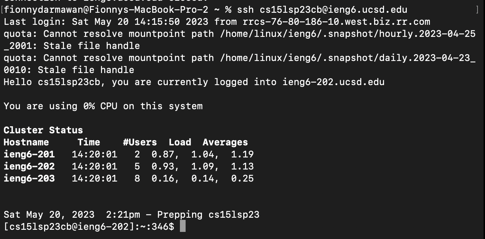
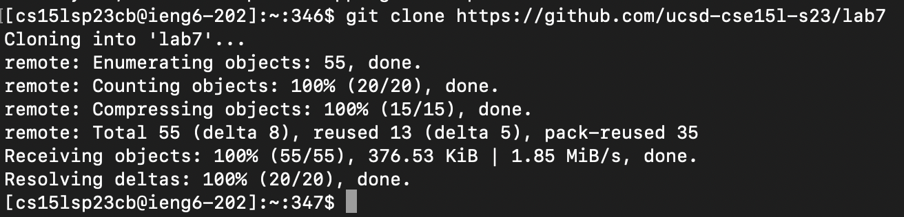
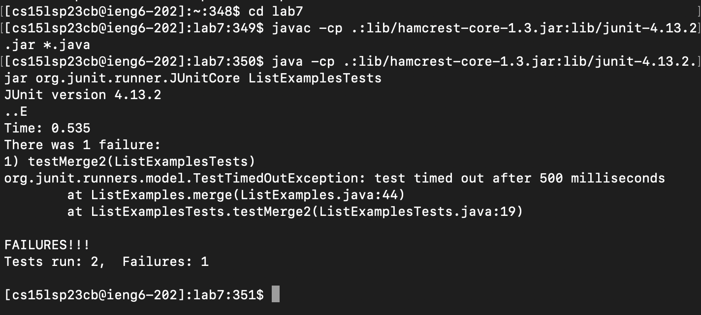
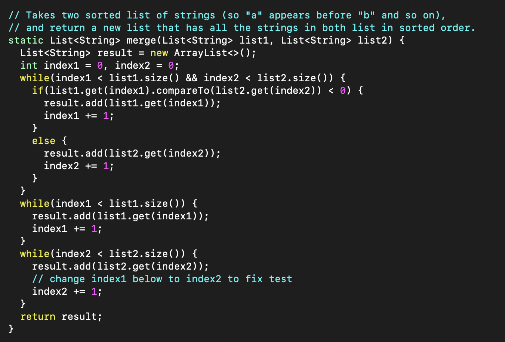
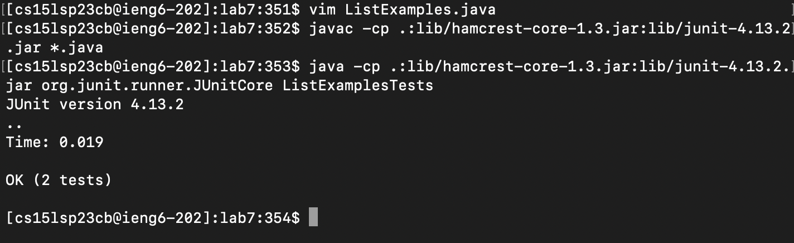
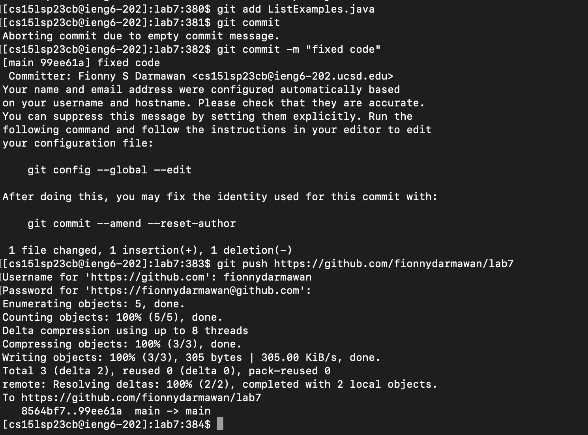

# Lab Report 4: Managing the Command Line
## This lab report demonstrates steps and ways to do some tasks all from the command line

## 1) Log into ieng6:

What I did to do this operation:
* Press <up> - The `ssh cs15lsp23cb@ieng6.ucsd.edu` command was 1 up in the search history,
  so I used the up arrow to access it on the terminal.
* Press <return>

## 2) Cloning fork into repository:

What I did to do this operation:
* Copied the URL `https://github.com/ucsd-cse15l-s23/lab7` on the web browser by pressing `command` then `c`
* Typed `git clone` and copied the URL by pressing `command` v, into the command line on the terminal.
* Pressed `<return>`

## 3) Running the test file (test fails):

  
What I did to do this operation:
* Copied the `javac -cp .:lib/hamcrest-core-1.3.jar:lib/junit-4.13.2.jar *.java` by pressing `command` then `c`,
  from the file `test.sh` in the GitHub repository (in web browser).
* Pressed `<command><V><return>` to copy the command and compile the test file on the terminal command line.
* Copied the `java -cp .:lib/hamcrest-core-1.3.jar:lib/junit-4.13.2.jar org.junit.runner.JUnitCore ListExamplesTests`
  by pressing `command` then `c`, from the file `test.sh` in the GitHub repository (in web browser).
* Press `<command><V><return>` to copy the command and run the test file into the terminal command line.
* Shows that the test failed.

   
## 4) Edit code in Vim:

  
What I did to do this operation:
* Pressed `<up><return>`, the `cd lab7` command was 1 up in the search history, so I used up arrow to access it on the terminal -
  this command goes into the lab7 path of the repository directory. 
* Pressed `<up><up><up><up><up><up><return>`, the `vim ListExamples.java` command was 6 up in the search history - 
  this command will access the file to edit on vim in the terminal. 
* Typed `/index1`, pressed `<n>(9x)<right>(6x)<i><delete><2><esc><:><w><q>` - these keys allowed me to get to the specific line
  and edit the line to fix the code, as well as saving it. 
  - the `/` key was used to find all (`index1`) in the file. 
  - the `<n>` key was used to get to the next occurrence of `index1`.
  - the `<i>` (insert) key allowed me to edit the file (deleting 1 and inserting 2). 
  - the `:wq` saved the changed file and quits vim. 

## 5) Running the test file (test succeeds):

  
What I did to do this operation:
* Pressed `<up>(3x)<return>`, the `javac -cp .:lib/hamcrest-core-1.3.jar:lib/junit-4.13.2.jar *.java` was 3 up in the search history
* Pressed `<up>`(3x)<return>`, the `java -cp .:lib/hamcrest-core-1.3.jar:lib/junit-4.13.2.jar org.junit.runner.JUnitCore ListExamplesTests`
  was up 3 up in the search history. 
* Shows that the test passed.

## 6) Commit and Push change to Github:

  
What I did to do this operation:
* Pressed `<up>(9x)<return>`, the `git add ListExamples.java` command was up 9 times in the search history
  - this command added changes I made into the gitHub repository. 
* Pressed `<up>(9x)<return>`, the `git commit -m "fixed code"` command was up 9 times in the search history
  - this command crated a new commit with the command "fixed code" to the changes I made into the gitHub repository. 
* Pressed `<up>(9x)<return>`, the `git push https://github.com/fionnydarmawan/lab7` command was up 9 times in the search history 
  - this command uploaded the commit into the gitHub repository. 
