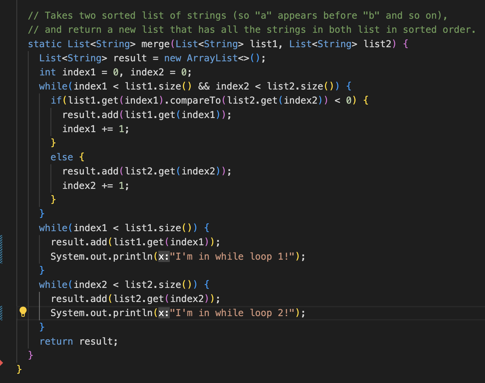
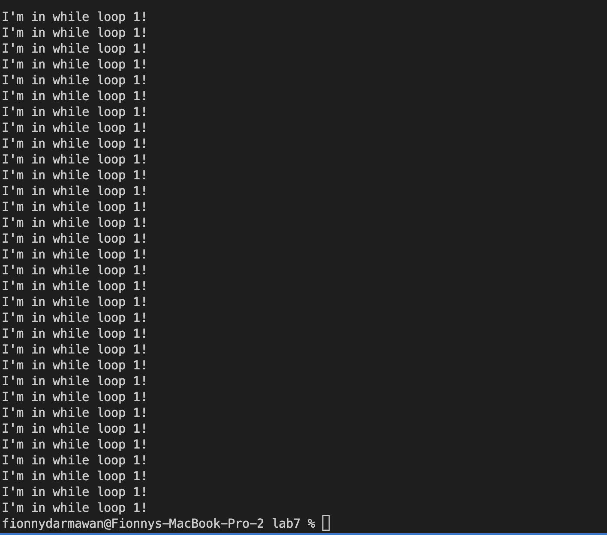
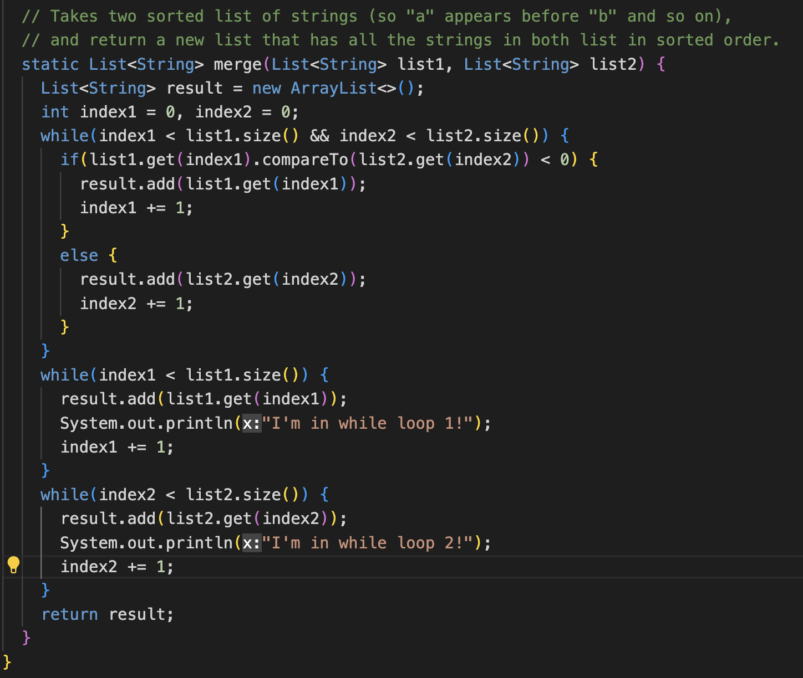
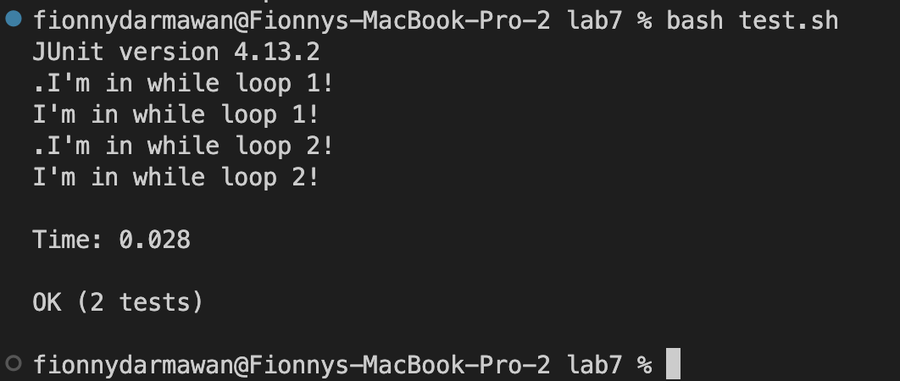

# Lab Report 5
## Part 1: Debugging Scenario 

### Original Post:

**What environment are you using (computer, operating system, web browser, terminal/editor, and so on)?**

VSCode Terminal 

**Detail the symptom you're seeing. Be specific; include both what you're seeing and what you expected to see instead. Screenshots are great, copy-pasted terminal output is also great. Avoid saying “it doesn't work”.**

I am receiving a "TestTimedOutException" when I run my code. It seems like there is something wrong with my implementation of the merge method, specifically in the two while loops. Below is a screenshot of my method implementation and the output on the terminal. Could you help me figure out what a TestTimedOutException means and how can I approach figuring out and addressing what the issue is?  

**Detail the failure-inducing input and context. That might mean any or all of the command you're running, a test case, command-line arguments, working directory, even the last few commands you ran. Do your best to provide as much context as you can**

I am in the correct directory. I am running the test.sh bash script and the test file seems to compile, it's just the tests that are failing to pass. 

### TA Response: 

Hello, thanks for your detailed question! A "TestTimedOutException" is an exception that is thrown when a test case or a test method exceeds the specified time limit for execution. This exception is usually thrown to prevent ests from running indefinitely like scenarios where a test may hang or get stuck due to a deadlock, infinite loop, or other issues. 

In regards to your code, you can try printing out some lines in your while loop implementation to see if your test even reaches the two while loops and if they do, what is happening with the results of the while loops implmentation. Printing out some strings would be helpful to see the results. Based on the code you provided from the screenshot, it may be that your tests result in an infinte loop since you are not incrementing the index. Hence the resulting TestTimedOutException. 

### Student Response: 

Hello! Thanks for the input, I printed out some strings in the while loops and yes it seems like I'm getting an infinite result of the print statement that I put. It seems like the merge method will not terminate and will keep adding the same element indefinitely. Below is the output showing the issue/bug of my implementation. 

Here we can see that my test is going in the first while loop and is just adding the same element infinitely.

So to fix this I wrote a line in each while loop to increment each index by 1 so that it will sort through the array in order all the way to the end of the array to reach the final result. Below is the fixed implementation and result. 

## Part 2: Reflection 

