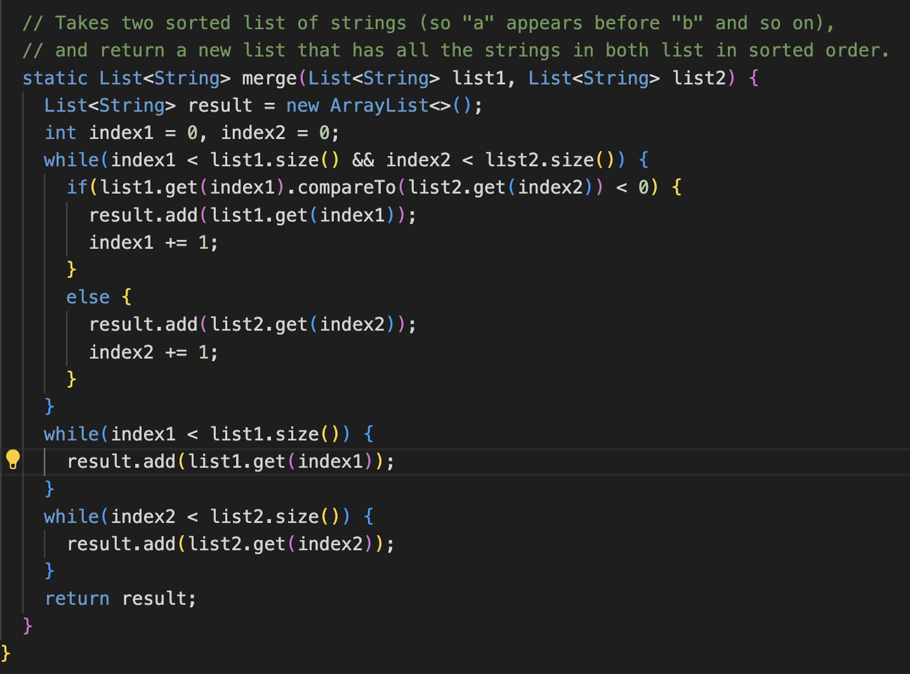
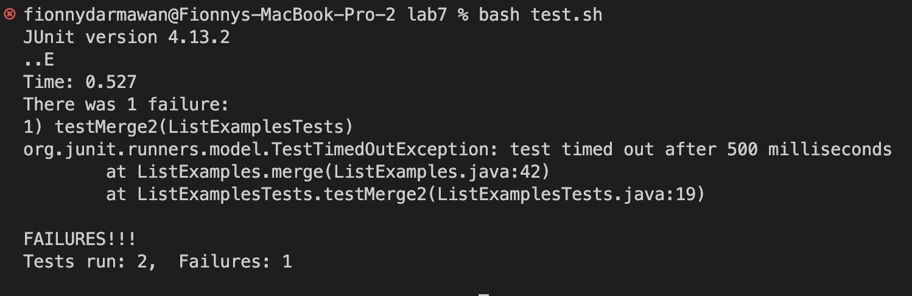

# Lab Report 5
## Part 1: Debugging Scenario 

### Original Post:

**What environment are you using (computer, operating system, web browser, terminal/editor, and so on)?**

VSCode Terminal 

**Detail the symptom you're seeing. Be specific; include both what you're seeing and what you expected to see instead. Screenshots are great, copy-pasted terminal output is also great. Avoid saying “it doesn't work”.**

I am receiving a "TestTimedOutException" when I run my code. It seems like there is something wrong with my implementation of the merge method, specifically in the two while loops. Below is a screenshot of my method implementation and the output on the terminal. Could you help me figure out what a TestTimedOutException means and how can I approach figuring out and addressing what the issue is?  

**Detail the failure-inducing input and context. That might mean any or all of the command you're running, a test case, command-line arguments, working directory, even the last few commands you ran. Do your best to provide as much context as you can**

I am in the correct directory. I am running the test.sh bash script and the test file seems to compile, it's just the tests that are failing to pass. 

### TA Response: 

